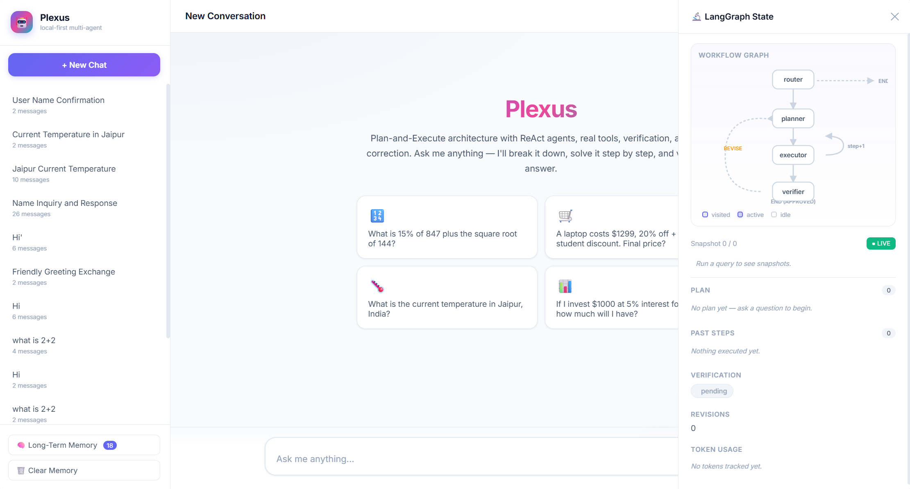
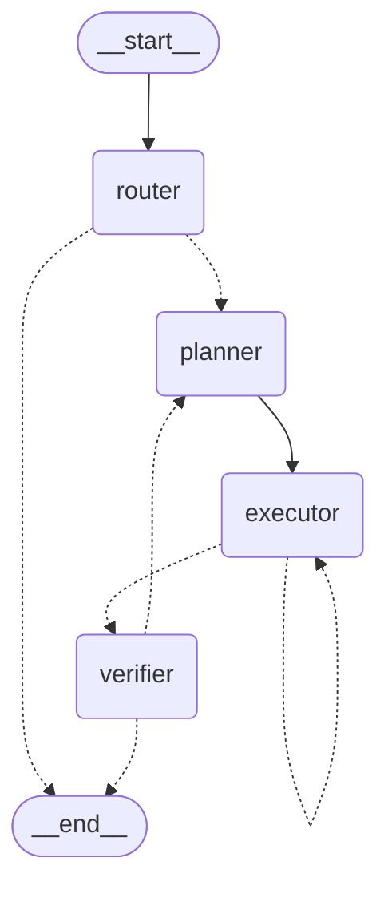

<div align="center">

# Plexus

**A local-first multi-agent system built on LangGraph + Ollama.**

Router → Plan → Execute → Verify, with reflection loops and human-in-the-loop.

[](https://www.python.org/)
[](https://github.com/langchain-ai/langgraph)
[](https://ollama.com/)
[](https://flask.palletsprojects.com/)
[](#license)

<br/>



<sub><em>The LangGraph State drawer: live workflow graph, per-snapshot plan / past steps / verifier status / token usage.</em></sub>

</div>

---

## Why Plexus

Most agent frameworks treat every question the same — every "hi" pays the cost of a full plan/execute/verify loop. Plexus front-loads a **router** that fast-paths trivial questions in a single LLM call, then escalates anything tool-worthy through a proper plan-and-reflect pipeline.

- **Local-first.** Everything runs on your machine through [Ollama](https://ollama.com/). No API keys, no telemetry, no cloud round-trips.
- **Reflective.** A strict verifier rejects hallucinations, prompt-injection contamination, and unsupported claims — the planner then revises.
- **Pausable.** The executor can call `ask_user` mid-step (LangGraph `interrupt`) and resume from the same `thread_id` once you answer.
- **Observable.** A live SSE-driven UI streams each agent's tokens into its own trace card and lets you scrub through every state snapshot.

---

## Architecture

```
START → router ──┬── direct answer ──────────────────────────────────→ END
                 │                                            REVISE
                 └── planner → executor (self-loops) → verifier ──→ planner
                                                            └── APPROVED → END
```

<details>
<summary>Generated LangGraph topology (Mermaid)</summary>



</details>

| Node | What it does |
|------|--------------|
| **router** | One LLM call. Emits `PLAN` to defer, otherwise answers directly. Saves 10–15s on greetings and trivial Q&A. A deterministic regex guard also force-routes obvious greetings/intros even if the LLM misfires. |
| **planner** | Builds a minimal numbered plan. On a revision pass, the failed plan + verifier feedback are injected so the next plan corrects the errors. |
| **executor** | Runs **one** step with a fresh `create_react_agent` bound to all tools, then self-loops until the plan is done. |
| **verifier** | Strict reviewer + final-answer writer. Emits `APPROVED <answer>` or `REVISE: <bullets>` (up to `max_revisions`). |

The compiled graph uses a `MemorySaver` checkpointer keyed by `thread_id`, which is what makes `ask_user` interrupts resumable.

Re-render the diagram at any time:

```bash
python gen_graph.py          # writes output/workflow.mmd + output/workflow.png
```

---

## Quick start

**1. Pull a model in Ollama.**

```bash
ollama pull gpt-oss:120b-cloud   # or any model you prefer
```

**2. Install dependencies.**

```bash
pip install -r requirements.txt
```

**3. Run.**

```bash
python main.py                       # Web UI on :5000 + terminal REPL
python main.py "What is 15% of 847?" # One-shot CLI (no server)
python main.py --no-server           # REPL only
python main.py --no-cli              # Web UI only
```

The default mode hosts **both** the web UI at <http://localhost:5000> and a terminal REPL in the same process, sharing one compiled graph and one memory store.

---

## The UI

A single-file vanilla-JS frontend ([static/index.html](static/index.html)) that talks SSE to Flask.

- **Live agent trace cards** — router, planner, executor, and verifier each get their own color-coded card with streaming tokens, elapsed timer, and progress bar.
- **Workflow graph panel** — an SVG of the four-node topology that lights up along the path actually taken on the current turn.
- **🔬 State drawer** — scrub through every state snapshot of a run: `plan`, `past_steps`, verifier verdict, revision count, token usage at that moment.
- **🔬 View workflow** button — replays the full state history of any past assistant message, even after a reload.
- **Markdown rendering** — tables, lists, code blocks, headers, blockquotes, inline `code`, **bold**, *italic*, and links all render natively.
- **Per-turn model picker** — switch between any installed Ollama model without restarting.
- **Sidebar** — auto-generated chat titles (an LLM summarizes after the first reply) and a long-term-facts editor.

---

## Configuration

Everything lives in [config.yml](config.yml) and is read once at import time. Restart after editing.

```yaml
ollama:
  base_url: http://localhost:11434
  model: gpt-oss:120b-cloud
  temperature: 0.2

agent:
  max_revisions: 3   # max verifier → planner loops
  max_steps: 15      # graph recursion limit
```

---

## Tools the executor can use

| Tool | Purpose |
|------|---------|
| `solve_math` | SymPy — the **anti-hallucination math tool**. Used for any arithmetic, algebra, or calculus. |
| `run_python` | Sandboxed Python with a whitelisted builtins dict. Local use only. |
| `calculator` | Quick arithmetic shortcut. |
| `web_search` | DuckDuckGo lookup for current/factual info. |
| `read_file` / `write_file` | File I/O. |
| `ask_user` | Pauses the graph via `interrupt` and waits for a human answer. |

---

## How state works (read before extending)

Two state fields use LangGraph reducers and must **not** be naively overwritten:

- `messages` — `add_messages` reducer.
- `past_steps` — `operator.add`. Returning `[]` appends nothing, so history **accumulates across revisions on purpose** (gives the verifier full context). To truly reset, start a fresh `thread_id`.

All other fields are plain overwrites. **`token_usage` is a plain dict**, so each agent merges prior totals via `_merge_tokens` before returning — otherwise earlier counts are wiped.

Every LLM call goes through `_retry(fn, retries=2)` with exponential backoff. Cloud-hosted Ollama models (`*-cloud`) occasionally return `ResponseError: Internal Server Error` — those auto-retry. `GraphInterrupt` is **re-raised immediately** so HITL still pauses cleanly. Don't wrap LLM calls in a broad `except Exception` — that's the bug that historically broke `ask_user`.

---

## Where data lives

```
memory/
├── conversations.db   SQLite — one row per conversation, one per message.
│                      The `workflow` column stores the JSON state-trace so
│                      "View workflow" survives restarts.
└── long_term.json     Human-editable facts prepended to future prompts.
output/                Mermaid + PNG renders of the compiled graph, plus
                       any artifacts saved via the write_file tool.
```

---

## File layout

Six Python files. Each has a single top-down purpose — read it like a book.

```
config.py     Settings loader (config.yml) + make_llm() factory.
graph.py      State + 4 agent nodes + token helpers + build_graph().
tools.py      The 7 tools listed above.
prompts.py    Prompt templates for router / planner / executor / verifier.
memory.py     SQLite ConversationMemory + JSON LongTermMemory.
main.py       Flask SSE server + CLI REPL — one entry point, one process.
gen_graph.py  Renders the compiled LangGraph to Mermaid + PNG.
validate.py   40-task validation suite (accuracy + latency report).
```

Plus `static/index.html` (single-file UI), `config.yml`, `requirements.txt`, `memory/`, `output/`.

---

## Validation

The repo ships a benchmark harness that runs 40 tasks across routing, math, factual retrieval, reasoning, hallucination resistance, prompt-injection resistance, structured output, planning, memory, and multi-step execution.

```bash
python validate.py
```

It reports per-task pass/fail, latency, and an overall accuracy score. Router tasks are checked by asserting the planner was **not** invoked; everything else uses substring grading against expected/forbidden phrases.

---

## Design notes worth knowing

- **Per-turn `thread_id`.** Every `/api/chat` call generates a fresh `thread_id` so the checkpointer doesn't drag `past_steps` from earlier turns into a new run. `/api/resume` looks up the latest thread to continue a paused HITL session.
- **Conversation context window.** Prior turns are prepended to the planner's input by `_trim_history` with a 2000-token budget (newest-first). Tight enough not to blow context, generous enough that "now multiply that by 2" still works.
- **Title upgrade.** A new chat's title starts as the user's opening message, then an LLM rewrites it after the first reply for a one-line summary.
- **Werkzeug log silencing.** The Flask access log is suppressed so it doesn't garble the REPL when both surfaces run together.

---

## Known limitations

- `run_python` is sandboxed but **not hardened against an adversarial agent**. Don't expose it on a public endpoint without tightening the importer.
- Every answer longer than 50 chars is currently auto-saved as a long-term "fact". This grows unbounded — consider gating it via an extraction step in the verifier before deploying long-term.
- ASCII export of the workflow occasionally fails on certain graph shapes (`grandalf` finds no intersection); Mermaid + PNG export still work.

---

## Tech stack

- **[LangGraph](https://github.com/langchain-ai/langgraph)** — graph orchestration, checkpointer, interrupts.
- **[LangChain](https://github.com/langchain-ai/langchain) + [langchain-ollama](https://github.com/langchain-ai/langchain)** — model bindings and react-agent factory.
- **[Ollama](https://ollama.com/)** — local model serving.
- **[Flask](https://flask.palletsprojects.com/)** — SSE streaming for the UI.
- **[SymPy](https://www.sympy.org/)** — symbolic math for the anti-hallucination tool.
- **[DuckDuckGo Search (`ddgs`)](https://pypi.org/project/ddgs/)** — keyless web search.
- **SQLite** — conversation + workflow persistence (stdlib).

---

## License

MIT — see [LICENSE](LICENSE) if present, otherwise add one before publishing.

---

<div align="center">

Built with LangGraph and Ollama, running entirely on your machine.

</div>
